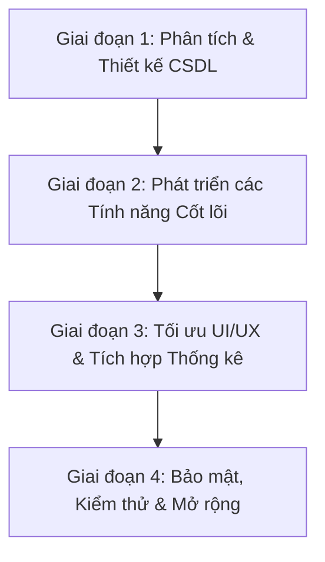

# KẾ HOẠCH PHÁT TRIỂN & TÀI LIỆU DỰ ÁN THỰC TẬP (HRMS)
## HỆ THỐNG QUẢN LÝ NHÂN SỰ, NGHỈ PHÉP & LƯƠNG THƯỞNG

Dự án này là một sản phẩm thuộc chương trình thực tập tốt nghiệp, tập trung giải quyết bài toán cốt lõi của doanh nghiệp: **Quản lý Hồ sơ nhân sự**, **Tự động hóa Quy trình xin nghỉ phép (Leave Management)** và **Tính toán Lương thưởng hàng tháng (Payroll)** một cách minh bạch, an toàn và trực quan.

---

## 🗺️ LỘ TRÌNH PHÁT TRIỂN (ROADMAP)

Dự án được chia thành 4 giai đoạn chính để đảm bảo chất lượng từ mặt logic nghiệp vụ, giao diện người dùng cho đến bảo mật hệ thống:



### Giai đoạn 1: Thiết kế Cơ sở dữ liệu & Cấu hình Hệ thống (Đã hoàn thành)
*   [x] Phân tích thực thể, xác định quan hệ giữa Nhân viên (`nhan_vien`) và Đơn xin nghỉ phép (`don_nghi_phep`).
*   [x] Cấu hình môi trường chạy Node.js, Express, kết nối cơ sở dữ liệu MySQL qua cổng kết nối XAMPP (mặc định hoặc tùy chỉnh `3000` / `3307`).
*   [x] Xây dựng cấu trúc thư mục chuẩn MVC đơn giản (gồm `index.js` điều hướng, `views/` chứa giao diện EJS).

### Giai đoạn 2: Phát triển Tính năng Cốt lõi (Đã hoàn thành)
*   [x] **Hệ thống Tài khoản (Authentication)**: Đăng nhập, đăng xuất, phân quyền người dùng (Chức vụ: 1 - Admin/Sếp, 2 - Quản lý/HR, >2 - Nhân viên).
*   [x] **Hộp đơn xin nghỉ**: Biểu mẫu tạo đơn xin nghỉ phép với các trường thông tin: Loại nghỉ (Nghỉ phép, Việc riêng, Ốm đau...), người bàn giao công việc, thời gian nghỉ và lý do chi tiết.
*   [x] **Quy trình Phê duyệt (Approval Workflow)**: Cấp quản lý/HR có thể phê duyệt hoặc từ chối đơn. Hỗ trợ tính năng thay đổi người bàn giao trực tiếp tại màn hình duyệt đơn nếu cần thiết.
*   [x] **Hệ thống Tính lương tự động**:
    *   Tự động tính lương cơ bản dựa theo chức vụ/phòng ban (Tester, BA, Fullstack, DA, Designer...).
    *   Cộng phụ cấp, tiền tăng ca (OT), tiền thưởng.
    *   Trừ các ngày nghỉ không lương (Việc riêng) dựa trên dữ liệu đơn nghỉ phép đã duyệt.
    *   Khấu trừ bảo hiểm bắt buộc theo luật định (10.5% lương cơ bản).

### Giai đoạn 3: Tối ưu UI/UX & Trực quan hóa dữ liệu (Đã hoàn thành)
*   [x] Nâng cấp giao diện sang phong cách hiện đại (Apple-like design) với các bo góc mềm mại, độ bóng mịn, màu cam chủ đạo (`#f26522`), và tương thích tốt trên thiết bị di động.
*   [x] Tích hợp **Chart.js** vẽ biểu đồ ngay tại Dashboard:
    *   Biểu đồ tròn (Doughnut Chart): Phân bổ lý do nghỉ phép của nhân viên.
    *   Biểu đồ cột (Bar Chart): Thống kê số ngày nghỉ phép lũy kế theo từng tháng trong năm hiện tại.
*   [x] Hiển thị nhanh các thông tin cảnh báo quan trọng:
    *   Danh sách nhân sự vắng mặt hôm nay để các phòng ban tiện theo dõi và sắp xếp nhân lực thay thế.
    *   Hộp thông báo nhận bàn giao cá nhân của nhân viên đang đăng nhập.

### Giai đoạn 4: Bảo mật & Kế hoạch Nâng cấp tương lai (Đang thực hiện)
*   [ ] **Bảo mật**:
    *   [x] Tích hợp mã hóa mật khẩu một chiều sử dụng thuật toán **Bcrypt**.
    *   [x] Cơ chế tự động phát hiện mật khẩu dạng thô (plain-text) để mã hóa ngược lại cơ sở dữ liệu trong lần đăng nhập đầu tiên.
    *   [x] Tích hợp khiên chống tấn công dò mật khẩu (Brute Force) bằng **Express-Rate-Limit** (Khóa tạm thời 15 phút nếu nhập sai quá 5 lần).
    *   [ ] Sử dụng file môi trường `.env` để bảo mật thông tin kết nối CSDL và khóa bảo mật Session.
*   [ ] **Nâng cấp Nghiệp vụ (Tính năng mở rộng)**:
    *   [ ] Chuẩn hóa cơ sở dữ liệu sang dạng chuẩn 3NF (tách bảng `phong_ban`, `chuc_vu`, `luong_dinh_muc` riêng biệt).
    *   [ ] Tích hợp gửi email thông báo tự động (Nodemailer) cho Quản lý khi có đơn mới và cho Nhân viên khi đơn được phê duyệt/từ chối.
    *   [ ] Bổ sung chức năng Xuất báo cáo lương, danh sách nhân viên ra file **Excel/PDF**.
    *   [ ] Tích hợp phân hệ chấm công (Check-in/Check-out hàng ngày bằng địa chỉ IP công ty hoặc Wi-Fi).

---

## 💻 CÔNG NGHỆ SỬ DỤNG (TECH STACK)

| Vai trò | Công nghệ / Thư viện | Chi tiết ứng dụng |
| :--- | :--- | :--- |
| **Backend Core** | Node.js & Express.js | Xây dựng API và xử lý logic nghiệp vụ |
| **Database** | MySQL | Hệ quản trị cơ sở dữ liệu quan hệ lưu trữ thông tin |
| **Template Engine** | EJS (Embedded JavaScript) | Render giao diện động phía server |
| **Styling Framework**| Bootstrap 5 & Vanilla CSS | Thiết kế giao diện responsive và tùy chỉnh CSS Apple Style |
| **Security** | Bcrypt & Express-Session | Mã hóa thông tin và quản lý phiên làm việc của người dùng |
| **Rate Limiter** | Express-Rate-Limit | Chống tấn công Brute Force spam đăng nhập |
| **Data Viz** | Chart.js | Vẽ biểu đồ thống kê trực quan trên Dashboard |

---

## 📂 CẤU TRÚC THƯ MỤC DỰ ÁN

```text
project-thuc-tap/
├── ket_noi_csdl.js       # Module cấu hình kết nối database (MySQL)
├── index.js              # Server chính, chứa toàn bộ route điều hướng & logic app
├── package.json          # Quản lý dependencies và scripts chạy dự án
├── PLAN.md               # Tài liệu này (Kế hoạch và lộ trình phát triển dự án)
├── views/                # Thư mục chứa giao diện EJS
│   ├── dang_nhap.ejs          # Màn hình đăng nhập bảo mật
│   ├── dashboard.ejs          # Bảng điều khiển trung tâm (thống kê + biểu đồ)
│   ├── tao_don.ejs            # Biểu mẫu tạo đơn xin nghỉ phép
│   ├── duyet_don.ejs          # Giao diện dành riêng cho Sếp/HR để phê duyệt đơn
│   ├── lich_su.ejs            # Lịch sử và trạng thái đơn xin nghỉ của cá nhân
│   ├── quan_ly_nhan_su.ejs    # Màn hình quản lý hồ sơ và thêm mới nhân sự
│   └── bang_luong.ejs         # Phiếu chi tiết lương tháng tự động tính toán
└── node_modules/         # Các thư viện phụ thuộc của Node.js (tự động tạo khi cài đặt)
```

---

## 🗄️ THIẾT KẾ CƠ SỞ DỮ LIỆU (DATABASE SCHEMA)

Cơ sở dữ liệu mang tên `he_thong_nhan_su` gồm 2 bảng quan hệ chính:

### 1. Bảng `nhan_vien` (Lưu thông tin nhân sự)
```sql
CREATE TABLE `nhan_vien` (
  `ma_nhan_vien` INT AUTO_INCREMENT PRIMARY KEY,
  `ho_ten` VARCHAR(100) NOT NULL,
  `email` VARCHAR(100) UNIQUE NOT NULL,
  `mat_khau` VARCHAR(255) NOT NULL, -- Đã mã hóa Bcrypt
  `so_dien_thoai` VARCHAR(15),
  `phong_ban` VARCHAR(100),         -- Vị trí chuyên môn (vd: Tester, Fullstack Developer...)
  `luong_co_ban` INT DEFAULT 5000000,
  `ma_chuc_vu` INT DEFAULT 3,        -- 1: Sếp/Admin, 2: Quản lý/HR, 3: Nhân viên thông thường
  `tong_ngay_phep` INT DEFAULT 12,
  `ngay_phep_da_dung` INT DEFAULT 0,
  `phu_cap` INT DEFAULT 1000000,
  `tien_ot` INT DEFAULT 0,
  `thuong` INT DEFAULT 0
);
```

### 2. Bảng `don_nghi_phep` (Lưu vết đơn xin nghỉ phép)
```sql
CREATE TABLE `don_nghi_phep` (
  `ma_don` INT AUTO_INCREMENT PRIMARY KEY,
  `ma_nhan_vien` INT,
  `loai_nghi` VARCHAR(50) NOT NULL,    -- Nghỉ phép, Việc riêng, Ốm đau
  `nguoi_ban_giao` VARCHAR(100),       -- Tên nhân viên nhận bàn giao công việc
  `ngay_bat_dau` DATE NOT NULL,
  `ngay_ket_thuc` DATE NOT NULL,
  `ly_do` TEXT,
  `trang_thai` VARCHAR(50) DEFAULT 'Chờ duyệt', -- Chờ duyệt, Đã duyệt, Đã hủy, Từ chối
  `ngay_tao` TIMESTAMP DEFAULT CURRENT_TIMESTAMP,
  FOREIGN KEY (`ma_nhan_vien`) REFERENCES `nhan_vien`(`ma_nhan_vien`) ON DELETE CASCADE
);
```

---

## 🚀 HƯỚNG DẪN CÀI ĐẶT & CHẠY DỰ ÁN

### Yêu cầu hệ thống
1.  **Node.js** (Phiên bản v16 trở lên).
2.  **XAMPP** (Để kích hoạt Apache & MySQL).

### Các bước triển khai

**Bước 1: Tải mã nguồn về máy**
```bash
git clone <url-repo-github-cua-ban>
cd project-thuc-tap
```

**Bước 2: Cài đặt các thư viện liên quan**
```bash
npm install
```

**Bước 3: Khởi tạo Cơ sở dữ liệu**
1.  Mở ứng dụng **XAMPP Control Panel** và nhấn **Start** dịch vụ MySQL (mặc định chạy cổng `3306` hoặc đổi sang `3307`).
2.  Truy cập đường dẫn [http://localhost/phpmyadmin](http://localhost/phpmyadmin).
3.  Tạo mới một cơ sở dữ liệu tên là: `he_thong_nhan_su` với định dạng mã hóa `utf8mb4_general_ci`.
4.  Copy và chạy các câu lệnh SQL ở phần **Thiết kế Cơ sở dữ liệu** phía trên để tạo bảng và chèn một số dòng dữ liệu nhân viên chạy thử.

**Bước 4: Khởi động Server**
```bash
node index.js
```
Màn hình console xuất hiện dòng chữ: `Server đang chạy tại: http://localhost:3000` và `Chúc mừng! Kết nối Cơ sở dữ liệu thành công với Node.js.` là hệ thống đã sẵn sàng.

---

*Tài liệu này được biên soạn phục vụ cho đợt báo cáo thực tập tốt nghiệp và lưu trữ tiến trình phát triển dự án.*
