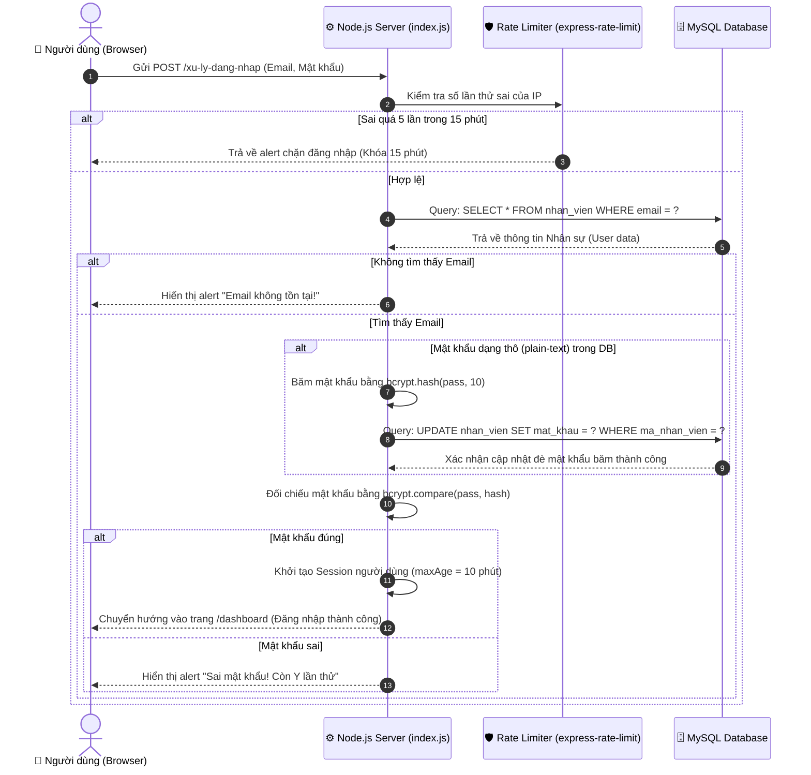
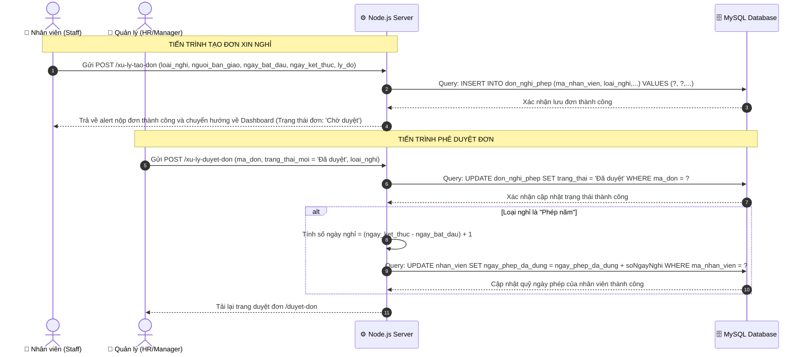
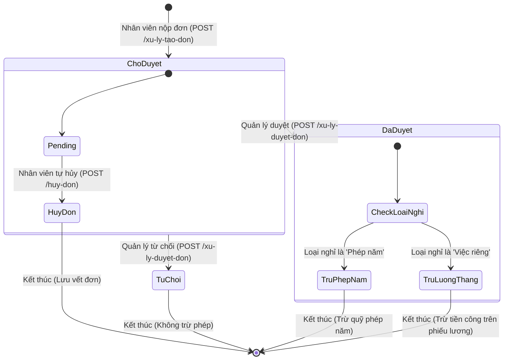

# TÀI LIỆU SƠ ĐỒ THIẾT KẾ HỆ THỐNG (SYSTEM UML DIAGRAMS)

> [!NOTE]
> ### 🔗 LIÊN KẾT HỆ THỐNG TÀI LIỆU DỰ ÁN
> *   **Kế hoạch dự án (Project Plan):** [PROJECT_PLAN](file:///d:/staff-absence-tracker-main/staff-absence-tracker-main/PROJECT_PLAN)
> *   **Đặc tả Use Case & Sơ đồ:** [USE_CASE_SPEC.md](file:///d:/staff-absence-tracker-main/staff-absence-tracker-main/USE_CASE_SPEC.md)
> *   **Sơ đồ thiết kế hệ thống (UML):** [SYSTEM_DIAGRAMS.md](file:///d:/staff-absence-tracker-main/staff-absence-tracker-main/SYSTEM_DIAGRAMS.md)
> *   **Kịch bản kiểm thử (50 Test Cases):** [TEST_CASES.md](file:///d:/staff-absence-tracker-main/staff-absence-tracker-main/TEST_CASES.md)

---

Tài liệu này cung cấp các sơ đồ tuần tự (Sequence Diagrams) và sơ đồ trạng thái (State Diagram) mô tả chi tiết luồng xử lý dữ liệu và logic nghiệp vụ thực tế trong mã nguồn của bạn.

---

## 1. SƠ ĐỒ TUẦN TỰ: ĐĂNG NHẬP BẢO MẬT (UC01)
Sơ đồ này mô tả chi tiết quy trình đăng nhập từ Trình duyệt (Browser) đi qua bộ lọc chống Brute Force (`express-rate-limit`), truy vấn cơ sở dữ liệu MySQL, thực hiện so khớp mật khẩu và tự động băm mật khẩu thô bằng `Bcrypt`.

---

## 2. SƠ ĐỒ TUẦN TỰ: QUY TRÌNH TẠO & PHÊ DUYỆT ĐƠN NGHỈ PHÉP
Sơ đồ mô tả quy trình nộp đơn xin nghỉ phép của Nhân viên và các hành động xử lý, chỉ định bàn giao chéo, cũng như logic trừ ngày phép tự động của cấp Quản trị/HR.

---

## 3. SƠ ĐỒ TRẠNG THÁI: VÒNG ĐỜI CỦA ĐƠN XIN NGHỈ PHÉP
Sơ đồ này trực quan hóa các trạng thái chuyển đổi của một đơn nghỉ phép từ khi khởi tạo, hủy bỏ, phê duyệt hoặc từ chối và tác động của nó đến quỹ phép hoặc bảng lương.

