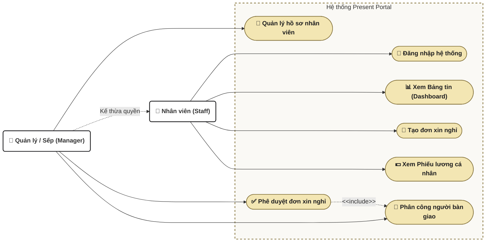

# TÀI LIỆU ĐẶC TẢ USE CASE TỔNG QUÁT (USE CASE SPECIFICATION)

> [!NOTE]
> ### 🔗 LIÊN KẾT HỆ THỐNG TÀI LIỆU DỰ ÁN
> *   **Kế hoạch dự án (Project Plan):** [PROJECT_PLAN](file:///d:/staff-absence-tracker-main/staff-absence-tracker-main/PROJECT_PLAN)
> *   **Đặc tả Use Case & Sơ đồ:** [USE_CASE_SPEC.md](file:///d:/staff-absence-tracker-main/staff-absence-tracker-main/USE_CASE_SPEC.md)
> *   **Sơ đồ thiết kế hệ thống (UML):** [SYSTEM_DIAGRAMS.md](file:///d:/staff-absence-tracker-main/staff-absence-tracker-main/SYSTEM_DIAGRAMS.md)
> *   **Kịch bản kiểm thử (50 Test Cases):** [TEST_CASES.md](file:///d:/staff-absence-tracker-main/staff-absence-tracker-main/TEST_CASES.md)

---

## 1. TỔNG QUAN HỆ THỐNG USE CASE
Hệ thống bao gồm 2 nhóm tác nhân (Actors) chính:
- **Nhân viên (Staff):** Thực hiện các tác vụ cá nhân (Đăng nhập, xem Dashboard, Tạo đơn xin nghỉ, xem Phiếu lương).
- **Quản lý / Sếp (Manager/Admin):** Kế thừa toàn bộ quyền của Nhân viên, đồng thời bổ sung các tác vụ quản trị (Phê duyệt đơn xin nghỉ, Thay đổi người bàn giao, Quản lý hồ sơ nhân sự).

### Sơ đồ Use Case Tổng quát (Mermaid UML Diagram)
Dưới đây là sơ đồ Use Case biểu diễn tương tác giữa các tác nhân và chức năng hệ thống:

---

## 2. ĐẶC TẢ CHI TIẾT CÁC USE CASE CỐT LÕI

### 2.1. UC01: Đăng nhập hệ thống (Authentication)
* **Tác nhân chính:** Nhân viên, Quản lý/HR, Sếp/Admin.
* **Mục tiêu:** Xác thực danh tính người dùng và cấp phiên làm việc (Session) để truy cập hệ thống.
* **Tiền điều kiện:** Người dùng đã có tài khoản tồn tại trong cơ sở dữ liệu (`nhan_vien`).
* **Luồng sự kiện chính (Basic Flow):**
  1. Người dùng nhập Email và Mật khẩu tại màn hình đăng nhập.
  2. Hệ thống kiểm tra Email trong cơ sở dữ liệu.
  3. Hệ thống kiểm tra mật khẩu bằng thuật toán đối chiếu **Bcrypt**.
  4. Hệ thống cấp Session lưu trữ thông tin đăng nhập của người dùng.
  5. Hệ thống chuyển hướng người dùng vào giao diện Bảng điều khiển trung tâm (Dashboard).
* **Luồng ngoại lệ (Alternative/Exception Flows):**
  - **Mật khẩu thô (Plain-text):** Nếu mật khẩu lưu trong DB dạng thô chưa băm, hệ thống tự động băm bằng Bcrypt, cập nhật đè vào DB và vẫn cho đăng nhập thành công.
  - **Sai mật khẩu/Email không tồn tại:** Hệ thống thông báo lỗi.
  - **Tấn công Brute Force:** Nếu nhập sai mật khẩu quá 5 lần liên tiếp, hệ thống kích hoạt Rate Limiter khóa tạm thời tài khoản của IP đó trong 15 phút.

---

### 2.2. UC02: Tạo đơn xin nghỉ phép (Create Leave Request)
* **Tác nhân chính:** Nhân viên (Staff).
* **Mục tiêu:** Gửi yêu cầu xin nghỉ phép lên cấp trên phê duyệt.
* **Tiền điều kiện:** Nhân viên đã đăng nhập thành công vào hệ thống.
* **Luồng sự kiện chính (Basic Flow):**
  1. Nhân viên chọn chức năng "Tạo đơn xin nghỉ".
  2. Nhân viên lựa chọn: *Loại nghỉ* (Phép năm, Việc riêng, Ốm đau), *Người bàn giao công việc* (từ danh sách nhân sự đã được loại trừ chính mình), chọn *Ngày bắt đầu*, *Ngày kết thúc* và điền *Lý do nghỉ*.
  3. Nhân viên nhấn nút "Nộp đơn".
  4. Hệ thống kiểm tra tính hợp lệ của dữ liệu đầu vào.
  5. Hệ thống lưu đơn vào cơ sở dữ liệu ở trạng thái mặc định là "Chờ duyệt" và hiển thị thông báo thành công.
* **Luồng ngoại lệ (Alternative/Exception Flows):**
  - **Lỗi logic thời gian:** Nếu chọn Ngày kết thúc trước Ngày bắt đầu, hệ thống ngăn chặn submit và báo lỗi.
  - **Bỏ trống trường bắt buộc:** Trình duyệt ngăn gửi form và yêu cầu điền đầy đủ.

---

### 2.3. UC03: Phê duyệt đơn xin nghỉ (Approve Leave Request)
* **Tác nhân chính:** Quản lý / Sếp (Manager/Admin).
* **Mục tiêu:** Duyệt hoặc Từ chối các đơn xin nghỉ phép đang chờ xử lý của nhân viên.
* **Tiền điều kiện:** Người duyệt có chức vụ thuộc diện quản lý (`ma_chuc_vu` <= 2).
* **Luồng sự kiện chính (Basic Flow):**
  1. Người duyệt truy cập vào mục "Duyệt đơn".
  2. Hệ thống hiển thị danh sách các đơn ở trạng thái "Chờ duyệt".
  3. Người duyệt có thể chọn lại người bàn giao công việc khác nếu cần.
  4. Người duyệt nhấn "Phê duyệt" (hoặc "Từ chối").
  5. Hệ thống cập nhật trạng thái đơn thành "Đã duyệt" (hoặc "Từ chối") trong DB.
  6. **Logic đồng bộ ngày phép:** Nếu loại đơn được duyệt là "Phép năm", hệ thống tự động tính số ngày nghỉ và cộng dồn vào quỹ ngày phép đã dùng (`ngay_phep_da_dung`) của nhân viên nộp đơn.
* **Luồng ngoại lệ (Alternative/Exception Flows):**
  - **Loại nghỉ không phải phép năm:** Nếu loại nghỉ là "Việc riêng" hoặc "Ốm đau", hệ thống cập nhật trạng thái đơn nhưng giữ nguyên ngày phép năm của nhân viên.

---

### 2.4. UC04: Xem Phiếu lương cá nhân (View Payslip)
* **Tác nhân chính:** Nhân viên (Staff).
* **Mục tiêu:** Theo dõi chi tiết thu nhập thực tế, các khoản phụ cấp và các khoản khấu trừ trong tháng.
* **Tiền điều kiện:** Nhân viên đã đăng nhập thành công vào hệ thống.
* **Luồng sự kiện chính (Basic Flow):**
  1. Nhân viên chọn mục "Phiếu lương".
  2. Hệ thống tự động truy vấn thông tin nhân viên trong DB.
  3. Hệ thống áp định mức lương cơ bản (Gross) tự động theo phòng ban.
  4. Hệ thống đếm số ngày nghỉ không lương (loại "Việc riêng" đã duyệt) trong tháng để tính tiền trừ ngày công.
  5. Hệ thống tính toán các khoản: Phụ cấp, tiền OT, tiền thưởng, bảo hiểm bắt buộc trích đóng 10.5%.
  6. Hệ thống tính toán Lương thực nhận: $NET = Gross - Khấu trừ$.
  7. Hệ thống hiển thị phiếu lương chi tiết lên giao diện người dùng.

---

### 2.5. UC05: Quản lý hồ sơ nhân sự (HR Administration)
* **Tác nhân chính:** Quản lý / Sếp (Manager/Admin).
* **Mục tiêu:** Quản lý danh sách nhân sự và thêm mới nhân viên vào hệ thống.
* **Tiền điều kiện:** Người thực hiện có chức vụ thuộc quản lý (`ma_chuc_vu` <= 2).
* **Luồng sự kiện chính (Basic Flow):**
  1. Người quản trị truy cập mục "Hồ sơ Nhân sự".
  2. Người quản trị nhấn "Thêm nhân viên" để mở modal nhập liệu.
  3. Nhập các thông tin: Họ tên, email, mật khẩu mặc định, số điện thoại, vị trí và mức lương cơ bản.
  4. Hệ thống tự động mã hóa mật khẩu mặc định bằng Bcrypt.
  5. Hệ thống lưu thông tin nhân sự mới vào DB và cập nhật lại danh sách hiển thị.
* **Luồng ngoại lệ (Alternative/Exception Flows):**
  - **Trùng lặp Email:** Nếu Email nhập vào đã tồn tại trong DB, hệ thống báo lỗi trùng lặp và hủy thao tác thêm mới.
